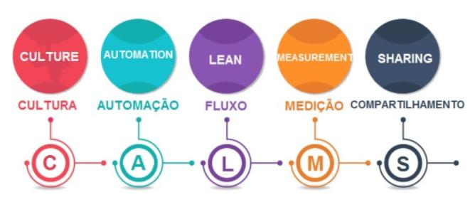
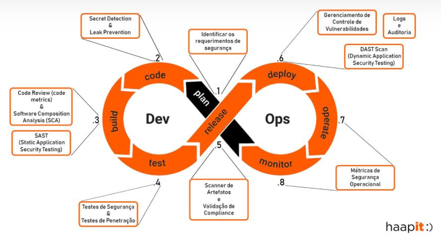

# Introdução

Com a popularização das metodologias ágeis, que trazem ideias de entregas incrementais e constantes surge a necessidade de garantir que os novos recursos e serviços desenvolvidos, bem como as melhorias feitas, sejam implementadas nos softwares já existentes sem que a qualidade e integridade do sistema seja prejudicada.  A partir dessa necessidade começam a surgir discussões sobre como resolver os problemas e conflitos entre as áreas de desenvolvimento, que prezavam pela entrega rápida das mudanças, e operações, que objetivavam manter a estabilidade  dos ambientes provisionados.

John Allspaw e Paul Hammond, durante a conferência Velocity da O’Reilly em  2009, apresentaram pela primeira vez o termo DevOps com o objetivo de unir desenvolvedores _(Dev)_ e administradores da infra de TI _(Ops)_. Propondo uma contínua integração entre as áreas foi apresentado o seminário “10+ Deploys per Day: Dev na Ops Cooperation at Flickr” onde resultados extraordinários para a época foram mostrados. Sendo esse considerado o marco inicial para o DevOps sua popularização ocorreu apenas ao final do ano de 2009 onde Patrick Debois, estimulado pelo seminário de John e Paul, criaria o DevOpsDay, um evento organizado na Ghent-Bélgica e durou 2 dias. A partir desse evento o conceito de DevOps começou a ser disseminado pelo mundo. 

Se tratando de uma cultura no âmbito da engenharia de software, o DevOps atualmente tem como principal princípio a aproximação do time de desenvolvimento do time de operações. Se tratando da união de pessoas, processos e tecnologias a cultura DevOps objetiva a contínua entrega de valor para os clientes e para tal traz consigo uma série de práticas e ferramentas. De tal forma, equipes que já adotaram o DevOps em seu dia a dia ganham capacidade de responder melhor às necessidades trazidas por seus clientes, aumentando assim a confiança no produto que é entregue.

Representando uma mudança no mundo da TI, o DevOps traz o foco na entrega rápida de serviços, adotando junto de si práticas ágeis, e na melhoria contínua do produto entregue.

## Os pilares do DevOps

O DevOps possui cinco pilares que enfatizam os comportamentos necessários para que seus princípios e objetivos sejam alcançados.

Esses pilares são conhecidos como __C.A.L.M.S__, representando respectivamente: cultura, automação, fluxo, medição e compartilhamento.

* __CULTURA__ – Focar nas pessoas; melhorar comportamentos; abraçar mudanças e experimentações; errar sem julgamentos (manter a segurança) e integrar Dev + Ops + TI + Produtos.

* __AUTOMAÇÃO__ – Fazer pequenas e constantes entregas; integrar alteração de código num repositório central (CI); pipeline (IC, Automatização de Testes e Deploy) e orquestrar.

* __FLUXO__ – Entregar valor para o usuário final (visão cliente); identificar o fluxo de valor e fazer fluir,sem interromper; enxutar processo e documentação; eliminar desperdício ( faturamento> gastos); perseguir a melhoria contínua e fazer o simples.

* __MEDIÇÃO__ – Medir e monitorar todo o ciclo (fluxos); identificar erros, defeitos e falhas; corrigir os problemas o quanto antes e melhorar o processo através de ações.

* __COMPARTILHAMENTO__ – Compartilhar conhecimentos e experiências; expor fracassos e sucessos; promover comunicação e colaboração entre os profissionais; integrar as áreas; feedbacks.

Sendo assim tais pilares devem ser seguidos e usados diariamente até que a Cultura DevOps seja vista como uma identidade nas empresas que a adotam.

## Benefícios do DevOps

A adoção da Cultura DevOps traz códigos benefícios agregados às suas práticas e princípios. Como principais benefícios temos:

* __Economia de recursos__: O DevOps deixa o setor de TI mais integrado ao promover uma comunicação entre os times. Com isso, reduzem-se gastos através da geração de menos erros.

* __Processos otimizados__: O DevOps facilita etapas a serem executadas e torna os fluxos mais fluidos e produtivos, isso se deve a automatização de etapas chaves desse fluxos.

* __Qualidade maior__: Com a preocupação em se manter a estabilidade dos ambientes provisionados o DevOps favorece uma maior qualidade do que é produzido, garantindo assim que os serviços desenvolvidos sejam estáveis, seguros e confiáveis.

* __Produção mais rápida__: Com a automação de processos, em especial as etapas de testes de de deploy, as entregas dos serviços produzidos se tornam mais rápidas, sem a necessidade de se alocar várias pessoas para que uma mudança seja aplicada.

* __Motivação maior__: Com todos os resultados, as equipes que adotam o DevOps se tornam mais produtivas, aumentando a confiança de seus membros e trazendo mais motivação a todos por saberem que o que está sendo produzido possui qualidade e confiabilidade.

## Ciclo DevOps

* __Planejamento__: fase em que se pensa como será o produto, inicia-se o planejamento e gerenciamento do produto;

* __Codificação__: fase em que o produto começa a tomar forma, os desenvolvedores começar a criar códigos;

* __Build__: fase em que se inicia a integração contínua, etapa em que o código é submetido a uma série de verificações e validações;

* __Teste__: fase onde o código é submetido a testes unitários e validar a cobertura de código;

* __Release__: fase em que o produto é entregue com velocidade e de forma automática, garantindo a qualidade do software;

* __Deploy__: fase de implantação do software desenvolvido, nessa etapa podem ser feitas integrações com o docker, para adicionar containers, e o kubernetes, para orquestrar a aplicação;

* __Operação__: nesta etapa é adotada a infraestrutura como código, podendo-se versionar a infra e escalá-la para serviços de nuvem;

* __Monitoramento__: nesta fase a aplicação implementada e entregue é monitorada a fim de se garantir a qualidade do serviço e a localização de erros e bugs.

# Integração Contínua e Entrega Contínua (CI/CD)

_Continuous Integration_ (CI) e _Continuous Delivery_ (CD) significam integração contínua e entrega contínua. 

Em termos muito simples, a CI é uma prática moderna de desenvolvimento de software na qual as alterações incrementais de código são feitas com frequência e confiabilidade. As etapas automatizadas de criação e teste acionadas pelo CI garantem que as alterações de código que estão sendo mescladas no repositório sejam confiáveis. O código é então entregue de forma rápida e transparente como parte do processo de CD.

No mundo do software, CI/CD refere-se à automação que permite que alterações incrementais de código sejam entregues de forma rápida e confiável à produção.

## Importância

CI/CD permite que as organizações publiquem softwares de forma rápida e eficiente. Desta forma o processo para colocar produtos no mercado se torna algo rápido, entregando código continuamente em produção e garantindo um fluxo contínuo de novos recursos e correções por meio de um método de entrega mais eficiente. 

## Diferenças

A integração contínua é uma prática que envolve o time de desenvolvimento fazendo alterações e verificações em seu código. Devido à escala de requisitos e ao número de etapas envolvidas, esse processo é automatizado para garantir que os times possam criar, testar e empacotar seus aplicativos de maneira confiável. A CI ajuda a simplificar as alterações de código, aumentando assim o tempo para que os desenvolvedores façam alterações e contribuam para melhorar o software.

A entrega contínua é a entrega automatizada de código completo para ambientes como teste e desenvolvimento. O CD fornece uma maneira automatizada e consistente para que o código seja entregue a esses ambientes. A implantação contínua é a próxima etapa da entrega contínua. Cada mudança que passa nos testes automatizados é colocada automaticamente em produção, resultando em muitas implementações de produção.

Resumindo, CI é um conjunto de práticas executadas enquanto os desenvolvedores estão escrevendo código, e CD é um conjunto de práticas executadas após a conclusão do código.
