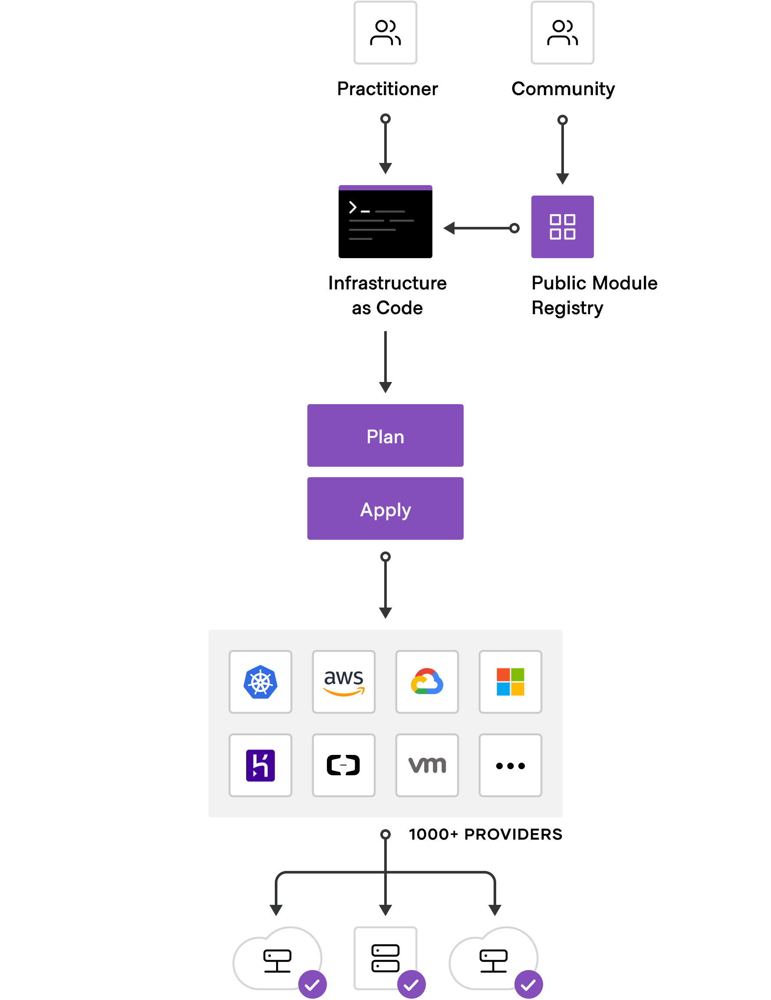

# Terraform

O Terraform é uma infraestrutura de código aberto como ferramenta de software de código que fornece um fluxo de trabalho CLI consistente para gerenciar centenas de serviços em nuvem. O Terraform codifica APIs de nuvem em arquivos de configuração declarativos.

## Funcionamento

O Terraform permite que a infraestrutura seja expressa como código em uma linguagem simples e legível por humanos chamada HCL (HashiCorp Configuration Language). Ele lê arquivos de configuração e fornece um plano de execução de alterações, que pode ser revisado para segurança e, em seguida, aplicado e provisionado.

Os provedores extensíveis permitem que o Terraform gerencie uma ampla variedade de recursos, incluindo IaaS, PaaS, SaaS e serviços de hardware.



## Comandos

### Init

Prepare seu diretório de trabalho para outros comandos.

```
terraform init
```

### Validate

Verifique se a configuração é válida.

```
terraform validate
```

### Plan

Mostrar as alterações exigidas pela configuração atual.

 ```
 terraform plan
 ```

### Apply

Criar ou atualizar infraestrutura.

```
terraform apply
```

### Destroy

Destruir a infraestrutura criada anteriormente.

```
terraform destroy
```

### Graph

Gerar um gráfico Graphviz das etapas em uma operação.

```
terraform graph | dot -Tsvg > graph.svg
```

### Fmt

Reformate sua configuração no estilo padrão.

```
terraform fmt
```

## Ferramentas Auxiliares

### __Terragrunt__

Terragrunt é uma ferramenta que visa auxiliar o uso do terraform, uma vez que foi criada com o intuito de facilitar a aplicação e gerência  dos módulos Terraform de forma eficiente.

Seu funcionamento consiste em implantar os recursos definidos em todos os módulos do terraform, na sequência correta, usando uma única operação.


A instalação do Terragrunt pode ser feita seguindo os tutorial disponivel em sua propria documentação atraves do seguinte link: https://terragrunt.gruntwork.io/docs/getting-started/install/#install-terragrunt.

Por se tratar de uma ferramenta feita para otimizar a utilização do Terraform alguns de seus comandos possuem correspondência com comandos do terraform. Seus comandos operam da seguinte forma: ao se executar um comando do Terragrunt o comando Terraform correspondente a operação é fornecido em uma 'pilha', onde uma 'pilha' é uma árvore de módulos terragrunt. O comando encontrará recursivamente módulos Terragrunt na árvore de diretórios atual e executará o comando terraform em ordem de dependência, exceto pelo comando destroy que ira ser executado na ordem reversa. Exemplos disso são:

* __Plan__: Isso irá pesquisar recursivamente no diretório de trabalho atual por quaisquer pastas que contenham módulos Terragrunt e sejam executados `plan` em cada um, simultaneamente, respeitando a ordenação definida via _dependency_ e _dependencies_ blocos.

```
terragrunt plan-all
```

* __Apply__: Isso irá pesquisar recursivamente no diretório de trabalho atual por quaisquer pastas que contenham módulos Terragrunt e sejam executados `apply` em cada um, simultaneamente, respeitando a ordenação definida via _dependency_ e _dependencies_ blocos.

```
terragrunt apply-all
```

* __Destroy__: Isso irá pesquisar recursivamente no diretório de trabalho atual por quaisquer pastas que contenham módulos Terragrunt e sejam executados `destroy` em cada um, simultaneamente, respeitando a ordenação definida via _dependency_ e _dependencies_ blocos.

```
terragrunt destroy-all
```

* __Validate__: Isso irá pesquisar recursivamente no diretório de trabalho atual por quaisquer pastas que contenham módulos Terragrunt e sejam executados `validate` em cada um, simultaneamente, respeitando a ordenação definida via _dependency_ e _dependencies_ blocos.

```
terragrunt validate-all
```

* __Graph-dependencies__: Isso irá pesquisar recursivamente o diretório de trabalho atual para quaisquer pastas que contenham módulos Terragrunt e construir o gráfico de dependência baseado em blocos _dependency_ e _dependencies_. 

```
terragrunt graph-dependencies | dot -Tsvg > graph.svg
```

### __Terraform Docs__

O Terraform Docs é um utilitário para gerar documentação de módulos Terraform em vários formatos de saída.

Pode ser acessado através do link: https://github.com/terraform-docs/terraform-docs, onde estão disponíveis as versões mais recentes e seu tutorial de instalação.

Sua execução pode ser feita de várias formas, seja ela através de etapas na execução de um pipeline ou de forma manual. A execução manual dessa fermanda pode ser feita através do seguinte comando:


```
terraform-docs markdown table --output-file README.md --output-mode inject /path/to/module
```

Sendo assim o arquivo da documentação será gerado em formato markdown com o título "README". O módulo documentado é indicado pelo _path_.